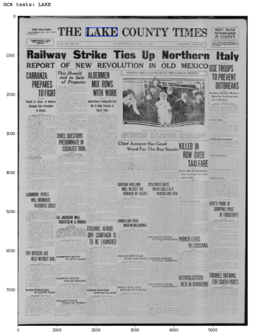
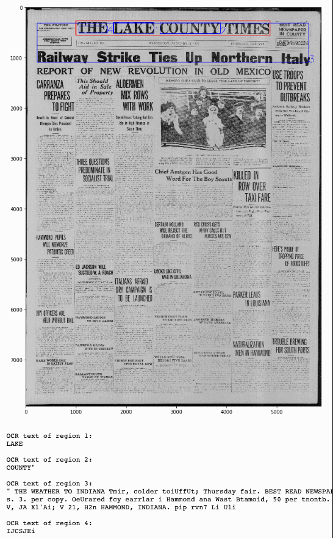

# Usage

## Use case 1: Display zone of interest and ONLY related OCR contents
From the mapping outout (`filename.json`), one can visualize a zone of interest and the *only* OCR contents (i.e., texts) within the zone.

## Use case 2: Display zone of interest and ALL related OCR contents
From the mapping outout (`filename.json`), one can visualize a zone of interest and *all* OCR contents (i.e., texts and coordinates) overlapped with the zone.

